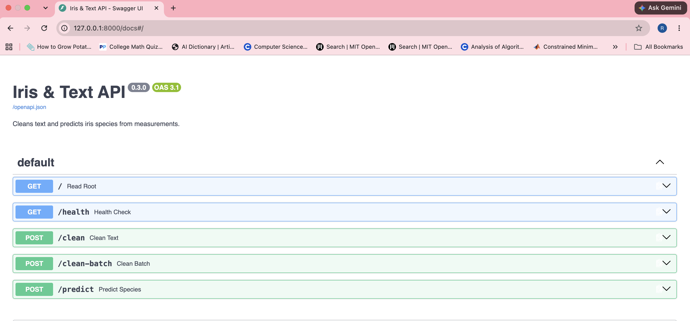
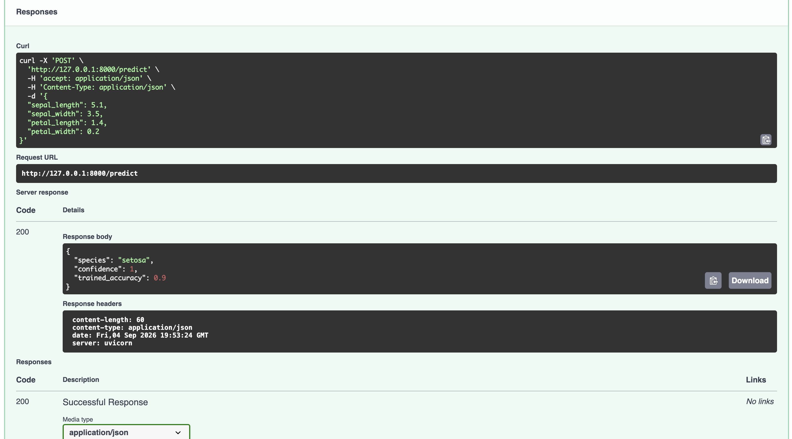

# Iris Classification & Text Preprocessing API

A production-style REST API that serves a machine learning model,
built with FastAPI and scikit-learn.

## What it does

- **`POST /predict`** — classifies an iris flower into one of three species
  from four measurements, returning the prediction with a confidence score.
- **`POST /clean`** — normalizes whitespace and truncates text.
- **`POST /clean-batch`** — cleans a batch of documents, dropping empty ones.
- **`GET /health`** — reports service health and model status.



*Interactive OpenAPI docs, generated automatically from Python type hints.*



*A live request: four measurements in — species, confidence and model accuracy out.*

## Tech stack

Python 3.12 · FastAPI · Pydantic · scikit-learn · pytest · ruff · uv

## Engineering practices

- Model loaded **once at startup** via FastAPI's lifespan, not per request
- Input validation with Pydantic constraints — invalid data is rejected
  with `422` before reaching the model
- Model persisted with its metadata (class names, feature order, accuracy)
  so predictions stay interpretable
- Reproducible training via a fixed random seed
- 11 automated tests covering both the logic and the endpoints
- Auto-generated OpenAPI documentation

## Getting started

```bash
git clone https://github.com/eylul22/python-project-setup.git
cd python-project-setup
uv sync

uv run python -m my_first_project.train        # train the model
uv run fastapi dev src/my_first_project/api.py # start the server
```

Then open http://127.0.0.1:8000/docs

## Example

```bash
curl -X POST http://127.0.0.1:8000/predict \
  -H "Content-Type: application/json" \
  -d '{"sepal_length":5.1,"sepal_width":3.5,"petal_length":1.4,"petal_width":0.2}'
```

```json
{"species": "setosa", "confidence": 1.0, "trained_accuracy": 0.9}
```

## Model

Random Forest (100 trees) on the classic iris dataset.
Test accuracy: **0.90** on a stratified 20% holdout.

## Author

Rahaf — AI Engineering student focused on ML deployment and integration.
